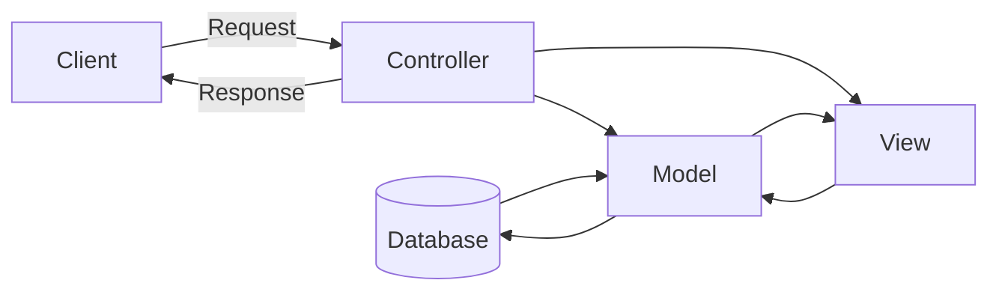
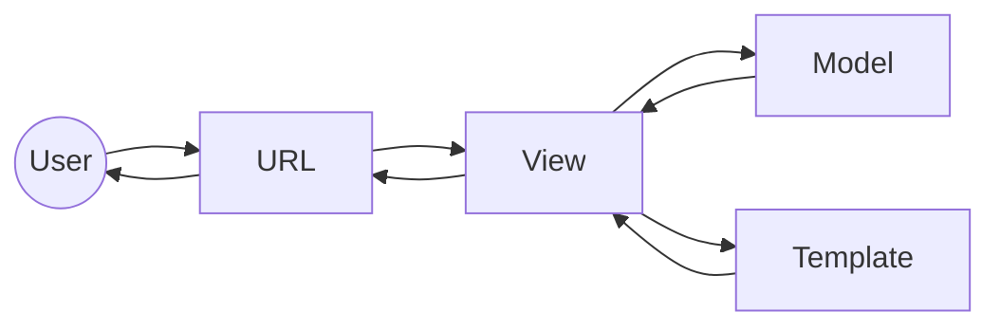

# Django notes

## Hello world of django
1. Install python
    ```shell
    sudo apt update
    sudo apt upgrade
    sudo apt install python3
    sudo apt install python3-pip
    ```

2. Install virtualenv
    ```shell
    sudo apt install python3-virtualenv
    ```

3. Create folder for the project
    ```shell
    mkdir django-tutorial
    cd django-tutorial
    ```

4. Create virtual environment
    ```shell
    python3 -m virtualenv django-venv
    ```

    Directory structure will look like this:
    ```
    ├── django_tutorial 
    │   └── django-venv 
    │       ├── bin 
    │       ├── lib 
    │       └── pyvenv.cfg 
    ```
5. Take note of the contents of the ```django-venv/bin``` folder

6. Activate the virtual environment
    ```shell
    source django-venv/bin/activate
    ```
    This will drop you in a new shell. See the ```(django-venv)``` at the beginning of the propt

7. Install django in the venv
    ```shell
    pip3 install django
    ```

8. Take note of the files in the ```django-venv/bin``` folder again. ```django-admin``` has appeared

9. Start a new project
    ```shell
    django-admin startproject myproject
    ```

    The directory structure will look like this:
    ```
    django_tutorial 
    │   ├── django-venv 
    │   │   ├── bin 
    │   │   │   ├── activate 
    │   │   │   ├── django-admin 
    │   │   │   ├── pip 
    │   │   ├── lib 
    │   │   └── pyvenv.cfg 
    │   └── myproject 
    │       ├── manage.py 
    │       └── myproject 
    │           ├── asgi.py 
    │           ├── __init__.py 
    │           ├── settings.py 
    │           ├── urls.py 
    │           └── wsgi.py 
    ```

10. Move into the new project folder
    ```shell
    cd myproject
    ```

11. Create a new app in the project
    ```shell
    python3 manage.py startapp myapp
    ```

    The directory structure will look like this:
    ```
    django_tutorial 
    │   ├── django-venv 
    │   └── myproject 
    │       ├── manage.py 
    │       ├── myapp 
    │       │   ├── admin.py 
    │       │   ├── apps.py 
    │       │   ├── __init__.py 
    │       │   ├── migrations 
    │       │   ├── models.py 
    │       │   ├── tests.py 
    │       │   └── views.py 
    │       └── myproject 
    │           ├── asgi.py 
    │           ├── __init__.py 
    │           ├── __pycache__ 
    │           ├── settings.py 
    │           ├── urls.py 
    │           └── wsgi.py 
    ```

12. Start the server
    ```shell
    python3 manage.py startserver
    ```
13. Open the given URL. You should see an ```The install worked successfully``` page

## Basic architecture

### MVC architecture
Model-View-Controller

Most web framework use this, but not django

- Controller: intercepts user requests.
- Model: data definitions, processing logic, interaction with database 
- View: presentation layer, placement and formatting, sends result to controller



### MVT architecture
Model-View-Template

Slight variation on the MVC

- Model: data layer
- View: processing logic
- Template: presentation layer



URL dispatcher:
- eqivalent to controller in MVC
- ```urls.py``` acts as dispathcer
    - defines URL patterns
    - a pattern is mapped with a view function

View:
- ```views.py```: created View definitions
- reads path, query, body parameters from requests
- interacts with model to perform CRUD operations
- uses the client's and model's data and renders its response using a template
- returns response to user

Model:
- ```models.py``` holds one or more model classes
- attributes of model class --> construct database table of matching structure
- view uses the client's and the model's data and renders its response using a template

Template:
- in the ```templates``` folder with the ```.html``` extension
- a template is a webpage
- mix of static HTML and Django Template Language blocks
- template preprocessor uses context data from View inserted in these blocks to formulate response
- View returns this response to the user

## Request - Response cycle

1. User enters URL in the web browser
2. URL is sent to the server
3. Server searches for this URL in the ```urls.py``` file
4. Server matches URL to associated view
5. View function receives the HTTP request as a ```HttpRequest``` object
6. View function defines the appropriate response
7. View functions sends back the response as a ```HttpResponse``` object

## Views and URLs

### View function

The function in the ```view.py``` (a.k.a view function):
 - fetches data from the client's request
    - takes a HttpRequest as parameter
 - applies a certain processing logic
 - sends the appropriate response back to the client
    - returns HttpResponse object


Function based view:
```python
# views.py (app)
from django.http import HttpResponse

def home(request):
    # some logic
    return HttpResponse("Welcome to Little Lemon restaurant")
```

Class based view:
```python
# views.py (app)
from django.http import HttpResponse
from django.views import View 

class MyView(View): 
    def get(self, request): 
        # logic to process GET request
        return HttpResponse('response to GET request') 
 
    def post(self, request): 
        # logic to process POST request 
        return HttpResponse('response to POST request')
```

### Routing

The ```urls.py``` file:
 - contains mapping view functions to a URLs
 - it is good practice to create a ```urls.py``` in the app folder and include it in the project's ```urls.py```. This way the respective URLs for an app are clustered
    - in this case create a ```urls.py``` in the ```myapp``` folder
 - when a user makes a request, it is first handled by the ```urls.py``` at the project level
    - the project level ```urls.py``` will have to include the app level ```urls.py```


 ```python
# urls.py (project)
from django.contrib import admin
from django.urls import path, include

urlpatterns = [
    path('admin/', admin.site.urls),
    path('', include('myapp.urls'))
]
 ```

```python
# urls.py (app)
from django.urls import path
from . import views

urlpatterns = [
    path('', views.home, name="home"),
]
```

## Request and Response objects

```python
# views.py (app)
from django.http import HttpResponse

def myview(request):

# --------------Request--------------------
    path = request.path
    scheme = request.scheme # a.k.a protocol
    method = request.method
    path_info = request.path_info
    all_headers = request.META
    address = request.META['REMOTE_ADDR']
    user_agent = request.META['HTTP_USER_AGENT']
    cookies = request.COOKIES
    cookie_value = request.COOKIES.get("my_cookie")
    files = request.FILES

    if request.method == 'GET':
        val = request.GET['key']
    
    if request.method == 'POST':
        val = request.POST['key']
    
    if request.user.is_authenticated():
        username = request.user.username
        email = request.user.email

# --------------Response--------------------
    plain_text_response = HttpResponse('This is some text.', content_type='text/plain') 

    json_data = {'dummy_key': 'dummy_value'}
    json_response1 = HttpResponse(
        json_data,
        headers={
            'Content-Type': 'application/json',
            'Content-Disposition': 'attachment; filename="dummy.json"',
        }

    response_with_cookie = HttpResponse('Response with cookie')
    response.set_cookie('my_cookie', 'cookie_value')
    response.content += f" Cookie value: {cookie_value}"

    response400 = HttpResponseBadRequest('400 Bad Request')
    response403 = HttpResponseForbidden('403 Forbidden')
    response404 = HttpResponseNotFound('404 Not Found')
    response405 = HttpResponseNotAllowed('405 Not allowed')
    response500 = HttpResponseServerError('500 Server Error')
```

## Request processing

How a request is processed:
1. Django loads the root URLconf (if not set differently)
2. Looks for the ```urlpattern``` variable
3. Django runs through each URL pattern and stops at the first that matches the requested URL
4. Django loads and calls the given view

## Parameters

### Path parameter

The client browser sends data along with the URL itself.

[http://example.com/getuser/John/](http://example.com/getuser/John/)
</br>
[http://example.com/getitem/42/](http://example.com/getitem/42/)
</br>
[http://example.com/getarticle/title_of_article/](http://example.com/getarticle/title_of_article/)
</br>
[http://example.com/getarticle/2025/](http://example.com/getarticle/2025/)
</br>
[http://example.com/getarticle/2025/03/](http://example.com/getarticle/2025/03/)

```python
# urls.py
from django.urls import path
from . import views

urlpatterns = [
    path('getuser/admin/', views.special_case_admin),
    path('getuser/<str:name>/', views.user_details),

    path('getitem/<int:id>', views.item_details),

    path('getarticle/<slug:title>', views.article_details),

    path('getarticle/<int:year>', views.article_year_archive),
    path('getarticle/<int:year>/<int_month>/', views.article_month_archive),
]
```

The URL pattern treats the identifiers in angular brackets (<..>) as the path parameters

[http://example.com/getarticle/2025/](http://example.com/getarticle/2025/)
    
- will call ```view.article_year_archive(request, year=2025)```

[http://example.com/getarticle/2025/03/](http://example.com/getarticle/2025/03/)

- will call ```article_month_archive(request, year=2025, month=03")```


```python
# views.py
from django.http import HttpResponse 

def article_year_archive(request, year): 
    return HttpResponse("Some response")

def article_month_archive(request, year, month): 
    return HttpResponse("Some response")
```

### Query parameters

A query string is a sequence of one or more key=value pairs concatenated by the ```&``` symbol.

The key-value pairs in the query string are added to the ```request.GET``` property.

[http://example.com/getuser/?name=John&id=1](http://example.com/getuser/?name=John&id=1)

```python
# urls.py
from django.urls import path
from . import views

urlpatterns = [
    path('getuser/', views.queryview),
]
```

```python
# views.py
from django.http import HttpResponse 

def queryview(request):
    name = request.GET['name']
    id = request.GET['id']
    return HttpResponse("Name:{} UserID:{}".format(name, id)) 
```

### Body parameters

An HTML form sends the data to the URL mentioned in its action attribute using the POST method.

The POST method is a more secure way of sending data than the GET method because the data is not revealed in the URL.

```python
# urls.py
from django.urls import path
from . import views

urlpatterns = [
    path("showform/", views.showform, name="showform"),
    path("getform/", views.getform, name='getform'),
]
```

```python
# views.py
from django.http import HttpResponse 

def showform(request): 
    return render(request, "form.html")

def getform(request): 
    if request.method == "POST": 
        id=request.POST['id'] 
        name=request.POST['name'] 
    return HttpResponse("Name:{} UserID:{}".format(name, id))
```