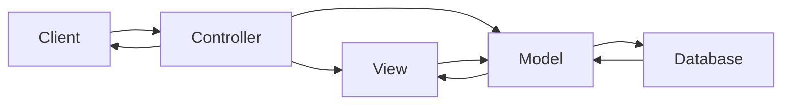
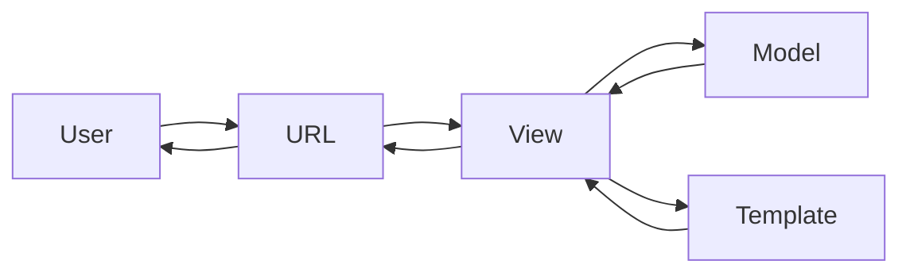

# Django notes

## Hello world of django
1. Install python
    ```shell
    sudo apt update
    sudo apt upgrade
    sudo apt install python3
    sudo apt install python3-pip
    ```

2. Install virtualenv
    ```shell
    sudo apt install python3-virtualenv
    ```

3. Create folder for the project
    ```shell
    mkdir django-tutorial
    cd django-tutorial
    ```

4. Create virtual environment
    ```shell
    python3 -m virtualenv django-venv
    ```

    Directory structure will look like this:
    ```
    ├── django_tutorial 
    │   └── django-venv 
    │       ├── bin 
    │       ├── lib 
    │       └── pyvenv.cfg 
    ```
5. Take note of the contents of the ```django-venv/bin``` folder

6. Activate the virtual environment
    ```shell
    source django-venv/bin/activate
    ```
    This will drop you in a new shell. See the ```(django-venv)``` at the beginning of the propt

7. Install django in the venv
    ```shell
    pip3 install django
    ```

8. Take note of the files in the ```django-venv/bin``` folder again. ```django-admin``` has appeared

9. Start a new project
    ```shell
    django-admin startproject myproject
    ```

    The directory structure will look like this:
    ```
    django_tutorial 
    │   ├── django-venv 
    │   │   ├── bin 
    │   │   │   ├── activate 
    │   │   │   ├── django-admin 
    │   │   │   ├── pip 
    │   │   ├── lib 
    │   │   └── pyvenv.cfg 
    │   └── myproject 
    │       ├── manage.py 
    │       └── myproject 
    │           ├── asgi.py 
    │           ├── __init__.py 
    │           ├── settings.py 
    │           ├── urls.py 
    │           └── wsgi.py 
    ```

10. Move into the new project folder
    ```shell
    cd myproject
    ```

11. Create a new app in the project
    ```shell
    python3 manage.py startapp myapp
    ```

    The directory structure will look like this:
    ```
    django_tutorial 
    │   ├── django-venv 
    │   └── myproject 
    │       ├── manage.py 
    │       ├── myapp 
    │       │   ├── admin.py 
    │       │   ├── apps.py 
    │       │   ├── __init__.py 
    │       │   ├── migrations 
    │       │   ├── models.py 
    │       │   ├── tests.py 
    │       │   └── views.py 
    │       └── myproject 
    │           ├── asgi.py 
    │           ├── __init__.py 
    │           ├── __pycache__ 
    │           ├── settings.py 
    │           ├── urls.py 
    │           └── wsgi.py 
    ```

12. Start the server
    ```shell
    python3 manage.py startserver
    ```
13. Open the given URL. You should see an ```The install worked successfully``` page

## Basic architecture

### MVC architecture
Model-View-Controller

Most web framework use this, but not django

- Controller: intercepts user requests.
- Model: data definitions, processing logic, interaction with database 
- View: presentation layer, placement and formatting, sends result to controller



### MVT architecture
Model-View-Template

Slight variation on the MVC

- Model: data layer
- View: processing logic
- Template: presentation layer



URL dispatcher:
- eqivalent to controller in MVC
- ```urls.py``` acts as dispathcer
    - defines URL patterns
    - a pattern is mapped with a view function

View:
- ```views.py```: created View definitions
- reads path, query, body parameters from requests
- interacts with model to perform CRUD operations

